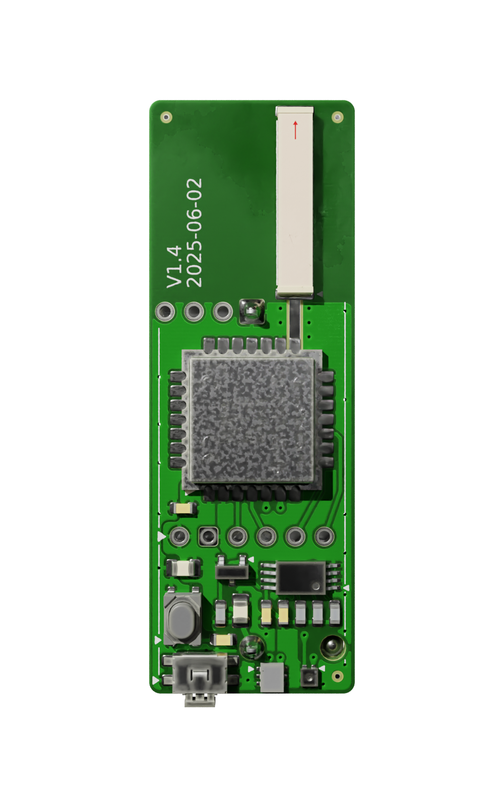

# Minimal size LoraWAN sensor node

This is a stripped-down version of https://github.com/Strooom/LoRa-V3-PCB
* no e-paper display
* no USB for charging
* non-volatile memory 128KByte io up to 512 KByte
* no BME68X - only SHT40 and TSL2591
* no QWIIC connector
* internal antenna with less gain
* application button is 1-way, io 3-way

KiCAD design files for the LoRa-V3-Mini PCB.

## Front render

